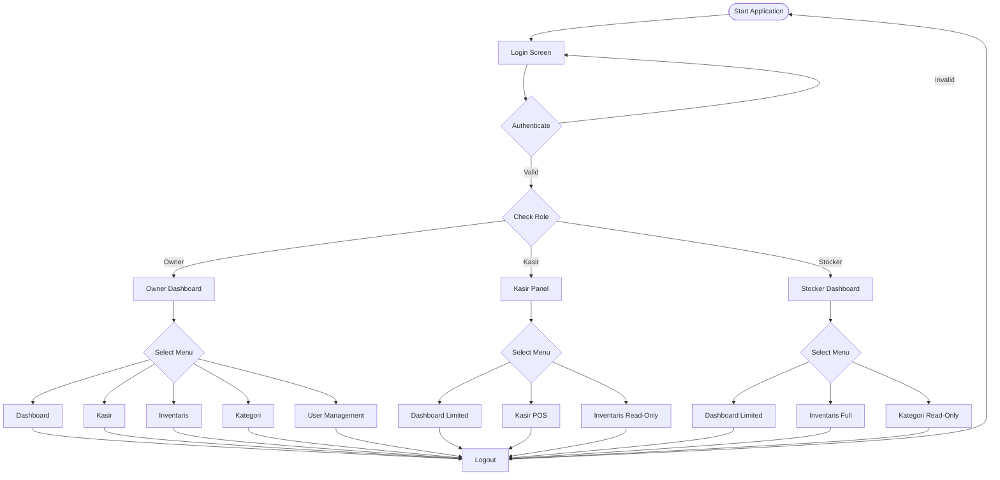
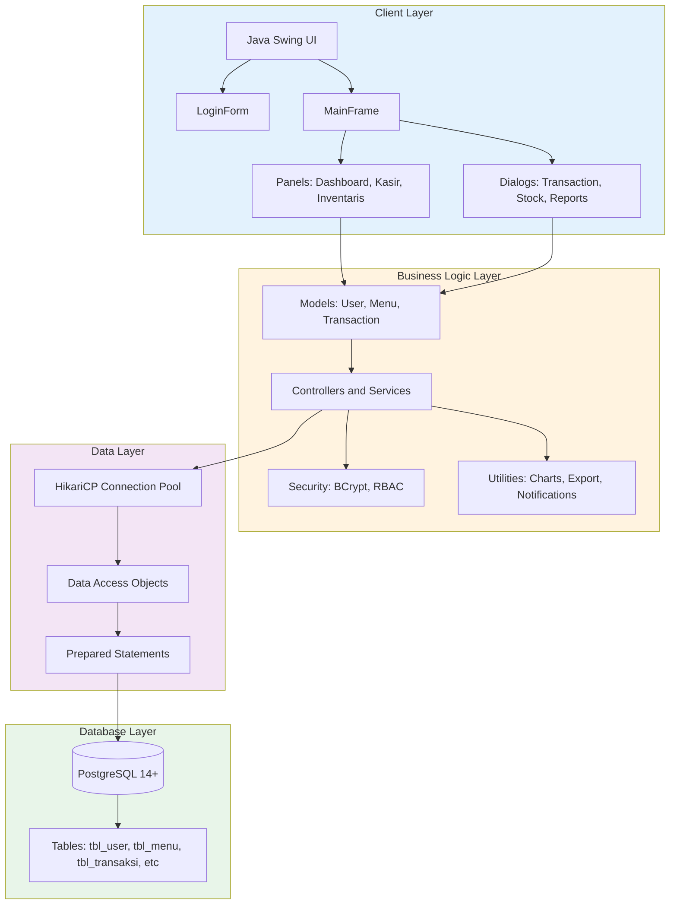
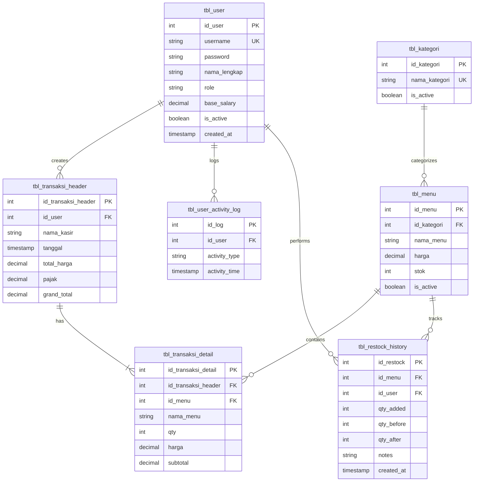
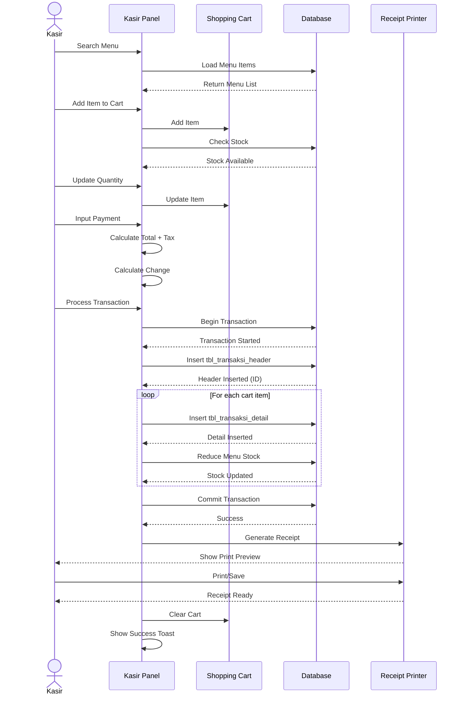
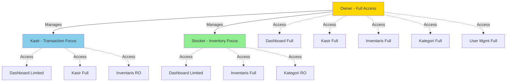

# Kedai Kopi Cak Budibud v2.0 🚀 - POS & Inventory Management


**Modern coffee shop management system** - Complete Point of Sale (POS) and inventory management built with Java Swing. Supporting multi-user with real-time data synchronization for efficient and professional coffee shop operations.

---

## 🎉 What's New in v2.0

> [!IMPORTANT] > **Major Release Alert!** Version 2.0 brings significant enhancements in financial reporting, data visualization, and user experience improvements.

### 🆕 Key Improvements

- ✨ **Enhanced Financial Dashboard** - 6-card comprehensive financial metrics
- 📊 **Advanced Reporting** - Detailed profit calculations with tax, salaries, and expenses
- 🎯 **Personalized Kasir Dashboard** - Sales filtered by individual cashier
- 📈 **Category-based Analytics** - Tab filtering for best-selling items by category
- 🔍 **Complete Menu Visibility** - All items displayed with smooth scrolling
- 💡 **Tooltip Hover** - Full value display for truncated numbers
- 📑 **Enhanced Excel Export** - Professional financial summary in exports
- ✅ **Improved Data Accuracy** - Chart data now includes tax calculations

### v1.0.0 vs v2.0 Comparison

| Feature                | v1.0.0             | v2.0                                  |
| ---------------------- | ------------------ | ------------------------------------- |
| **Financial Cards**    | 4 cards (Basic)    | 6 cards (Comprehensive)               |
| **Profit Calculation** | Revenue - Expenses | Laba Kotor - Restock - Tax - Salaries |
| **Kasir Dashboard**    | Global sales data  | Personalized (per cashier)            |
| **Best Selling View**  | Top 10 only        | All items with scroll                 |
| **Category Filter**    | Dropdown           | Tab-based navigation                  |
| **Chart Hover Data**   | Subtotal only      | Grand total (incl. tax)               |
| **Excel Export**       | Tables only        | Tables + Financial Summary            |
| **Activity Log**       | Oldest first       | Newest first                          |
| **Salary Integration** | None               | Full salary tracking                  |
| **Tooltip Support**    | None               | Full value on hover                   |

---

## 📖 About Application

### Background

Kedai Kopi Cak Budibud requires an integrated system to manage sales, inventory, and daily operations efficiently. This application provides an all-in-one solution helping coffee shop owners and staff with:

- **Fast Transaction Processing** - User-friendly cashier system with auto-refresh stock
- **Real-Time Stock Management** - Automatic stock tracking with low-stock alerts
- **Sales Analytics** - Interactive dashboard with chart visualizations
- **Multi-User Support** - Multiple cashiers can work simultaneously without data conflicts
- **Secure Team Management** - Role-based access control (RBAC)

---

## ✨ Features

### 🔄 REAL-TIME Multi-User Support ⚡

**Automatic Data Synchronization:**

- ✅ **Dashboard**: Auto-refresh every 5 minutes for all roles
- ✅ **Kasir Panel**: Auto-refresh every 1 minute for latest stock updates (CRITICAL!)
- ✅ **Inventaris Panel**: Auto-refresh every 2 minutes for stock monitoring
- ✅ **Multi-Kasir Safe**: Prevents overselling with real-time data
- ✅ **Single Database Truth**: All users see the same data

**Scenario:**

```
Kasir A sells 10 Latte (10:00 AM)
  ↓
Database: Stock updated 50 → 40
  ↓
Kasir B auto-refresh (10:01 AM)
  ↓
Kasir B sees latest stock: 40 ✅
  ↓
No overselling! ✅
```

### 🔐 Authentication & Security

- **Secure Login** with BCrypt password hashing (cost factor 12)
- **Role-Based Access Control (RBAC)** - Owner, Kasir, Stocker
- **Activity Logging** for audit trail
- **Session Management** with auto-update last login
- **SQL Injection Protection** with PreparedStatement

### 📊 Analytics Dashboard (Owner)

**Visualization with JFreeChart:**

- **Real-time Statistics**: Today's sales, total transactions, low stock
- **Line Chart**: 7-day sales trend
- **Pie Chart**: Sales distribution by category (30 days)
- **Bar Chart**: Top 10 best-selling menu with ranking
- **Alert Table**: Menu list with stock status (OUT/CRITICAL/LOW)
- **Auto-Refresh**: Dashboard data refreshed every 5 minutes

### 💰 Point of Sale (Kasir)

**Fast & Accurate Transactions:**

- **Smart Search**: Real-time search and filter by category
- **Interactive Cart**: Add, update quantity, remove items
- **Auto-Calculate**: Total, tax (10%), grand total, change
- **Stock Validation**: Check stock availability before checkout
- **Auto-Reduce Stock**: Stock automatically reduced after transaction
- **Inline Payment**: Direct payment in cashier panel without separate dialog

**🧾 Thermal Receipt Printer:**

- **Professional Format**: Like 58mm thermal printer receipt
- **Complete Info**: Store name, address, transaction no., cashier, date/time
- **Detail Items**: Qty, menu name, unit price, subtotal
- **Print Preview**: View receipt before print or save
- **Modal Dialog**: MUST close receipt before next transaction

**🎉 Toast Notifications:**

- Success (green), Error (red), Warning (orange), Info (blue)
- Slide-in animation and auto-dismiss
- Instant feedback for all actions

**🔄 Auto-Refresh (1 minute):** Menu and stock auto-updated for multi-kasir!

**🆕 v2.0 Enhancements:**

- **Personalized Sales** - View your own sales statistics
- **Best Selling Tabs** - Filter by category with tabs
- **Complete Menu List** - All items displayed with scroll
- **Data Accuracy** - Chart hover shows correct totals including tax

### 📦 Inventory Management (Stocker & Owner)

**Complete CRUD Menu:**

- Create, Read, Update, Delete menu
- Update stock (add/reduce) with tracking
- Filter by category and status
- Search by menu name
- Active/inactive status toggle

**📊 Stock Adjustment Logging:**

- Automatic logging every stock addition to `tbl_restock_history`
- Tracking user, date, and restock amount
- History viewable in Monthly Transaction Dialog

**🔄 Auto-Refresh (2 minutes):** Stock monitored automatically for all users!

### 🏷️ Category Management (Owner)

- CRUD product categories
- Dependency checking (prevent deleting used categories)
- Active/inactive status

### 👥 User Management (Owner Only)

- Add, edit, delete users
- Role assignment (Owner/Kasir/Stocker)
- Reset password with BCrypt auto-hashing
- Toggle active/inactive status
- **🆕 v2.0:** Salary management integration

### 📊 Reporting & Export

**Monthly Transaction Dialog:**

- View sales, stock-in, and stock-out transactions per month
- Filter by month and year
- Separate tables for each transaction type

**🆕 v2.0 Financial Summary (6 Cards):**

1. **Total Transaksi** - Transaction count
2. **Laba Kotor** - Gross profit (total revenue)
3. **Pengeluaran Restock** - Restock expenses
4. **Pajak** - Total tax collected
5. **Gaji Karyawan** - Total employee salaries
6. **Laba Bersih** - Net profit (Gross - Expenses - Tax - Salaries)

**Excel Export (Multi-Sheet):**

- Export monthly data to Excel with one button
- Sheet 1: Sales Transactions + **Financial Summary**
- Sheet 2: Stock In (Restock history)
- Sheet 3: Stock Out (Sales details)
- Auto-formatted with professional styling

### 🎨 Modern UI/UX

- **FlatLaf Light Theme** - Modern and clean appearance
- **Responsive MigLayout** - Adaptive to various screen sizes
- **Consistent Color Scheme** - Primary blue with accent colors
- **Smooth Animations** - Toast notifications and hover effects
- **Icon System** - SVG-based with IconManager utility
- **🆕 Tooltip Hover** - Full value display for truncated text

---

## 👥 Features Per Role

### 🏆 Owner (Full Access)

**Dashboard Analytics:**

- Complete financial overview with 6-card metrics
- Sales trend charts (7 days)
- Category distribution pie chart
- Best-selling items with rankings
- Stock alert monitoring
- Monthly transaction reports with Excel export

**Inventory Management:**

- Full CRUD operations for menu items
- Stock adjustments with history tracking
- Low stock alerts and monitoring
- Category management
- Pricing and availability control

**User Management:**

- Create/edit/delete user accounts
- Role assignment (Kasir/Stocker)
- Password reset functionality
- Activate/deactivate users
- Salary management

**Transaction Operations:**

- Full cashier capabilities
- Transaction history access
- Receipt printing and preview

### 💳 Kasir (Cashier)

**Transaction Processing:**

- Fast POS interface
- Smart menu search and filtering
- Interactive shopping cart
- Real-time stock availability
- Auto-calculation (tax, total, change)
- Thermal receipt generation
- Payment processing

**Personalized Dashboard (🆕 v2.0):**

- **Own sales statistics** - View your sales only
- Best-selling menu with category tabs
- Complete menu list with scroll
- Quick stock status overview

**Inventory (Read-Only):**

- View menu items and prices
- Check stock availability
- View categories

**Activity Tracking:**

- Transaction log filtered by cashier
- Today's sales summary

### 📦 Stocker (Inventory Specialist)

**Inventory Management:**

- Full CRUD operations for menu items
- Stock adjustments (add/reduce)
- Restock history tracking
- Low stock monitoring
- Auto-refresh stock data

**Dashboard (Limited):**

- Stock status overview
- Low stock alerts
- Inventory statistics

**Categories (Read-Only):**

- View all categories
- Check category assignments

---

## 📐 System Architecture

### User Flow Diagram



### System Architecture Diagram



### Database ER Diagram



### Transaction Sequential Diagram



### User Role Hierarchy



---

## 👥 Role Access Matrix

| Feature               | Owner             | Kasir                       | Stocker                 |
| --------------------- | ----------------- | --------------------------- | ----------------------- |
| **Dashboard**         | ✅ Full Analytics | ⚠️ Limited (Own Sales v2.0) | ⚠️ Limited (Stock Only) |
| **POS Kasir**         | ✅ Full Access    | ✅ Full Access              | ❌ No Access            |
| **Inventaris**        | ✅ Full CRUD      | 👁️ Read Only                | ✅ Full CRUD            |
| **Kategori**          | ✅ Full CRUD      | ❌ No Access                | 👁️ Read Only            |
| **User Management**   | ✅ Full CRUD      | ❌ No Access                | ❌ No Access            |
| **Financial Reports** | ✅ All Data       | ⚠️ Own Data (v2.0)          | ❌ No Access            |
| **Excel Export**      | ✅ Full Export    | ❌ No Access                | ❌ No Access            |
| **Activity Logs**     | ✅ All Users      | 👁️ Own Log                  | 👁️ Own Log              |

**Legend:**

- ✅ Full Access
- ⚠️ Limited/Filtered Access
- 👁️ Read Only
- ❌ No Access

**Default Credentials:**

- Owner: `admin` / `admin123`
- Kasir: `kasir1` / `admin123`
- Stocker: `stocker1` / `admin123`

---

## 🛠️ Technology Stack

**Core:**

- Java 17 (LTS)
- Maven 3.8+
- PostgreSQL 14+

**UI:**

- Java Swing
- FlatLaf 3.0+ (Modern Look & Feel)
- MigLayout 11.0 (Responsive Layout)

**Database:**

- HikariCP 5.0+ (Connection Pooling)
- PostgreSQL JDBC Driver

**Security:**

- BCrypt (at.favre.lib) - Password hashing with salt

**Charting:**

- JFreeChart 1.5.4 - Professional charts

**Excel:**

- Apache POI 5.2+ - Excel generation

**Utilities:**

- SLF4J 2.0+ & Logback 1.4+ (Logging)

---

## 📋 System Requirements

### Minimum Hardware

| Component | Requirement           |
| --------- | --------------------- |
| CPU       | Dual-core 2.0 GHz     |
| RAM       | 4 GB                  |
| Storage   | **150 MB** free space |
| Display   | 1366x768              |

### Recommended Hardware

| Component | Requirement           |
| --------- | --------------------- |
| CPU       | Quad-core 2.5 GHz+    |
| RAM       | 8 GB+                 |
| Storage   | **300 MB** free space |
| Display   | 1920x1080 (Full HD)   |

**Notes:**

- **App Size**: ~4 MB (source code + dependencies)
- **Installed Size**: ~50-100 MB (including Java runtime if not present)
- **Database Size**: ~10-50 MB (depends on transaction volume)

### Software Requirements

✅ **Java Development Kit (JDK) 17+**

- Download: [Adoptium Temurin](https://adoptium.net/)
- Verify: `java -version`

✅ **Apache Maven 3.8+**

- Download: [Maven Official](https://maven.apache.org/download.cgi)
- Verify: `mvn -version`

✅ **PostgreSQL 14+**

- Download: [PostgreSQL Official](https://www.postgresql.org/download/)
- Verify: `psql --version`

---

## 🚀 Installation & Setup

### Quick Start (5 Minutes!)

```bash
# 1. Clone repository
git clone https://github.com/athfizh/KedaiKopiApp-CakBudibud.git
cd kedai-kopi-app

# 2. Setup database
psql -U postgres
CREATE DATABASE db_kedai_kopi;
\c db_kedai_kopi
\i database_schema.sql
\i database_sample_data.sql
\i database_salary_update.sql
\q

# 3. Configure database connection
# Edit: src/main/java/com/kedaikopi/config/DatabaseConfig.java
# Set: DB_PASSWORD = "your_postgres_password"

# 4. Build & Run
mvn clean install
mvn exec:java -Dexec.mainClass="com.kedaikopi.Main"

# 5. Login
# Username: admin
# Password: admin123
```

### Detailed Installation for Client PC

See [QUICKSTART.md](QUICKSTART.md) for complete multi-user setup guide.

---

## 🔄 Real-Time Data Strategy

**Auto-Refresh Schedule:**

| Panel      | Interval  | Priority    | Reason                           |
| ---------- | --------- | ----------- | -------------------------------- |
| Dashboard  | 5 min     | Medium      | Business analytics & statistics  |
| **Kasir**  | **1 min** | **HIGH ⚡** | **Stock sync for multi-cashier** |
| Inventaris | 2 min     | Medium      | Stock monitoring                 |

**Benefits:**

- ✅ Prevents overselling in multi-user scenarios
- ✅ All roles see consistent, up-to-date data
- ✅ No manual refresh needed
- ✅ Optimized intervals - no database overload

---

## 📚 Documentation

- **README.md** (this file) - Complete overview and setup
- **QUICKSTART.md** - Quick deployment guide
- **Javadoc** - Generate with: `mvn javadoc:javadoc`

---

## 🐛 Troubleshooting

### ❌ Error: "Connection refused"

```
org.postgresql.util.PSQLException: Connection refused
```

**Solution:**

- Check PostgreSQL is running
- Verify database credentials in `DatabaseConfig.java`
- Check firewall allows port 5432

### ❌ Build Error: "Cannot read or execute"

**Solution:**

```bash
# Clear Maven cache
mvn clean

# Force update dependencies
mvn clean install -U
```

### ❌ Auto-Refresh Not Working

**Solution:**

- Check logs in `logs/application.log`
- Verify database connection active
- Restart application

---

## 👨‍💻 Developer

**Developed by**: **Athaulla Hafizh**  
**Institution**: Politeknik Negeri Malang (POLINEMA)  
**Program**: Teknik Informatika  
**Year**: 2025  
**Version**: 2.0

---

## 📄 License

MIT License - Free to use and modify for educational and commercial purposes.

---

## 🙏 Acknowledgments

- **JFreeChart** for charting library
- **FlatLaf** for modern Look & Feel
- **PostgreSQL** for robust database
- **HikariCP** for high-performance connection pooling
- **BCrypt** for secure password hashing
- **Apache POI** for Excel generation

---

## 📝 Changelog

### Version 2.0 (January 2025)

**🆕 New Features:**

- Enhanced financial dashboard with 6-card metrics
- Personalized cashier dashboard with filtered sales data
- Category-based tab filtering for best-selling items
- Complete menu display with scrolling (no 10-item limit)
- Tooltip hover for full value display
- Salary management integration
- Professional Excel export with financial summary

**✨ Improvements:**

- Chart hover data now includes tax (grand_total)
- Activity log sorted newest-first
- Improved profit calculations (Gross - Expenses - Tax - Salaries)
- Better visual hierarchy in financial reports
- Enhanced data accuracy across all panels

**🐛 Bug Fixes:**

- Fixed sales calculation to include tax properly
- Corrected database column references for salary data
- Improved session pairing in activity logs

### Version 1.0.0 (December 2024)

**Initial Release:**

- Basic POS functionality
- Inventory management
- User authentication
- Multi-user support
- Role-based access control
- Real-time data sync
- Receipt printing
- Excel export

---

**Selamat Menggunakan Kedai Kopi Cak Budibud v2.0! ☕**

> 💡 **Pro Tip**: Use multi-user setup for optimal real-time experience!

---

**© 2025 Athaulla Hafizh | POLINEMA**
